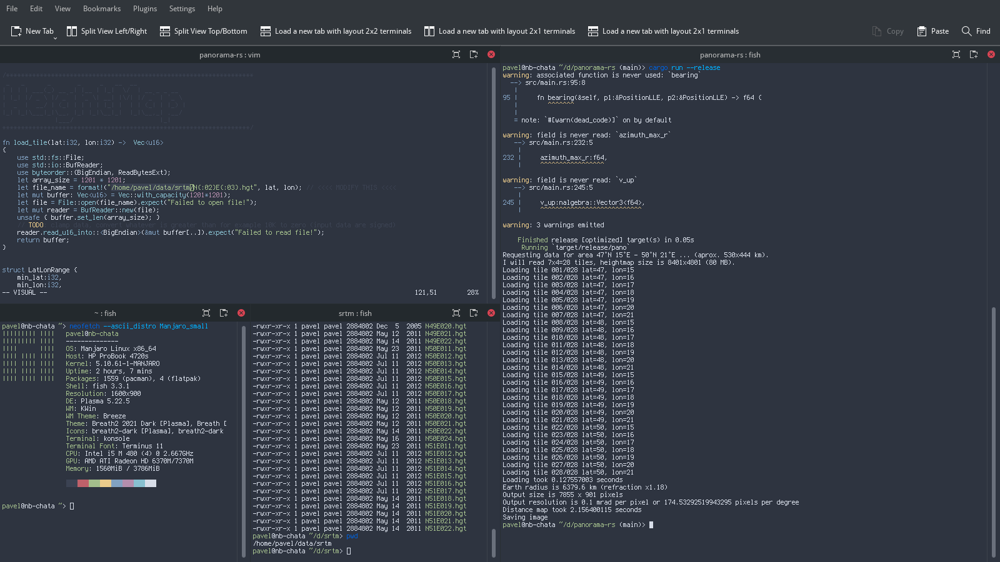

# What's this

First-ever Rust code attempt :-)

Panorama generator and voxel rendering engine. As of 2021-09-12 it can do only depth map.

See readme of the same project in Julia https://github.com/pavel-perina/panorama-jl

This one is basically 1:1 rewrite.

## Screenshots


Trying to run it in Linux on an old notebook


Part of distance map


## Performance comparison 

i5-4590@3.3GHz

Notes:
* Julia uses multithreaded loader (it's faster for some reason)
* Julia sets data that are out of reasonable range to zero (voids and artifacts)
* Both programs use 4 threads for distance map
* Reading data is significantly faster in Rust
* Crunching data is 50% faster in Rust
* I have almost no experience with these languages. However, I have some idea how to optimize programs in C++
* Neither program is particularly well optimized: writing of data by columns, trigonometric functions, possible memory writes to the same page by different threads,...

**Rust**
```
Requesting data for area 47°N 15°E - 50°N 21°E ... (aprox. 530x444 km).
I will read 7x4=28 tiles, heightmap size is 8401x4801 (81 MB).

Loading took 0.1099406 seconds
Earth radius is 6379.6 km (refraction x1.18)
Output size is 7855 x 901 pixels
Output resolution is 0.1 mrad per pixel or 174.53292519943295 pixels per degree
Distance map took 0.6668188 seconds
Saving image
```

**Julia**
```
Requesting data for area 47°N 15°E - 50°N 21°E ... (aprox. 530x444 km).
I will read 7x4=28 tiles, heightmap size is 8401x4801 (80 MB)

Loading tile 028/028 lat=48, lon=21
  0.248358 seconds (113.34 k allocations: 160.667 MiB, 5.53% gc time, 43.57% compilation time)
Earth radius is 6379.6 km (refraction x1.18)
Output size is 7855 x 901 pixels
Output resolution is 0.100000 mrad per pixel or 174.532925 pixels per degree
  0.993457 seconds (157.50 k allocations: 24.527 MiB, 0.00% compilation time)
min=0 max=4745
Saving distmap-gray.png
Extracting outlines ...
Saving outlines.png
Creating annotations
Loading data
Drawing ...
All done

```


## Language comparison

**Python** is great for anything that does not have to be fast. It's quite simple and if it gets job done, look no further. It's used almost everywhere and by nearly everyone for simple tools.

**Julia** has the same purpose. It's written to run fast and it compiles before code is executed. Despite it's pretty fast, compilation is slow, loading external modules as well. Language feels a bit immature, it's not widespread and problems are harder to solve. Despite it can be as simple as Python, code that is written without data types or immutable classes is not optimal (but still way faster than Python)
Julia has nice built-in tools for code profiling. Debugging is painfully slow (perhaps problem of VS Code?). Some design choices in the language seem weird (even compared to Rust)

Both Python and Julia use REPL (Read–eval–print loop) and they have shell or optional notebook support.

Support of Julia in VS Code feels worst.

**Rust** is different and in many ways it reminds C with some of the co. Code compiles to executable file. Syntax is quite unique and surprisingly somewhat similar to Julia. What I found unique is rust-analyzer and Visual Studio Code integration, where types are automagically determined as you write and displayed in the code and syntax is checked. Sometimes it's nice, sometimes it's pretty annoying. However neither of Python, Julia or Rust have classes like C++.

Rust has unusual hard-to-read syntax: `return y.atan2(x).to_degrees().rem_euclid(360.0);` compared to C++: `double a = atan2(y,x)*180.0/M_PI; return a>=0 ? a : a+360.0;`

Is Rust hard? I don't know. It's quite popular for some reason. Solutions to problems are not impossible to find, but they can be misleading. Many features are unique for sake of safety: 
* Everything is const by default
* Copy constructors are not present by default, which prevents passing copies by accident where reference can be used and various ugly side effects
* Threads are weird as they prevent writing to the same memory or variables
* Despite that safety features program can easily crash
* Some concepts about memory management and threads are weird, but they make *some* sense.
* Warnings about anything unused are annoying, but sometimes useful (when you have unused variable due to typo)

I had problems with creating threads in both Julia and Rust. Both have something to do with fact that thread runs in something like a lambda function. In Julia, it works. But it can result in many memory allocations and code that is slower than single-threaded. In Rust, there are problems with "safety"


**C++**. To be honest I have love and hate relationship with this language. I use it professionally. It's the most complex language with object oriented programming and templates being hardly compatible, standart template library is complicated and it does not solve many real world problems, there is no unified project definition for IDEs or compilers with CMake being closest. External dependencies are pain to set up and I would not bother with it for projects that depend on more than three external libraries. For building GUI applications with Qt ... fine. For building something that works with text files, images, database, or which plots graphs ... horror.
For larger applications that are worth initial pain ... fine. That's why I tried Julia and Rust.

